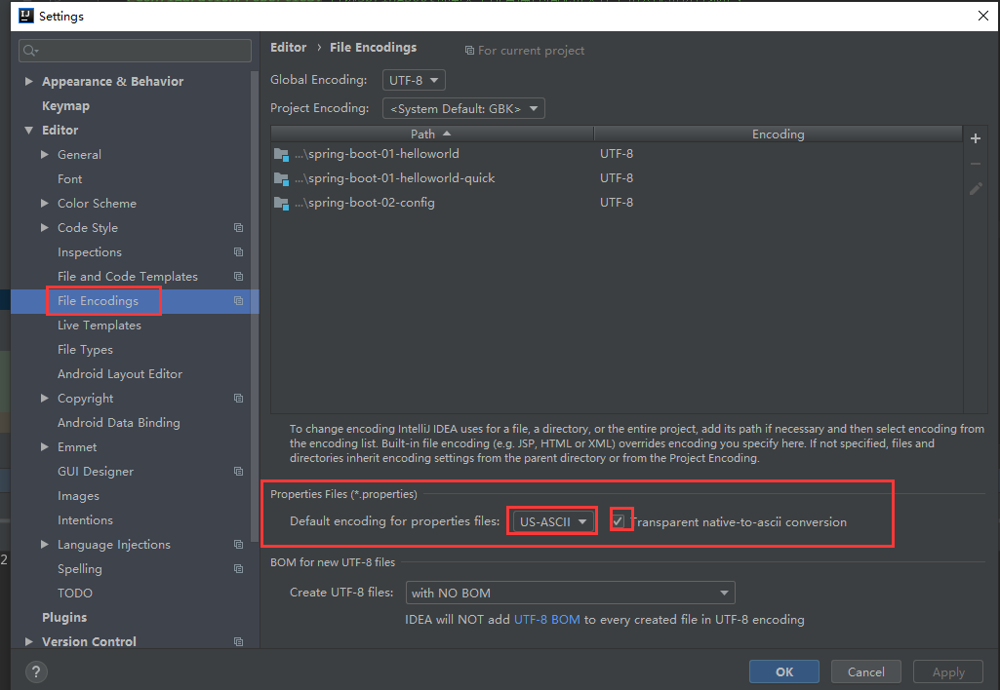
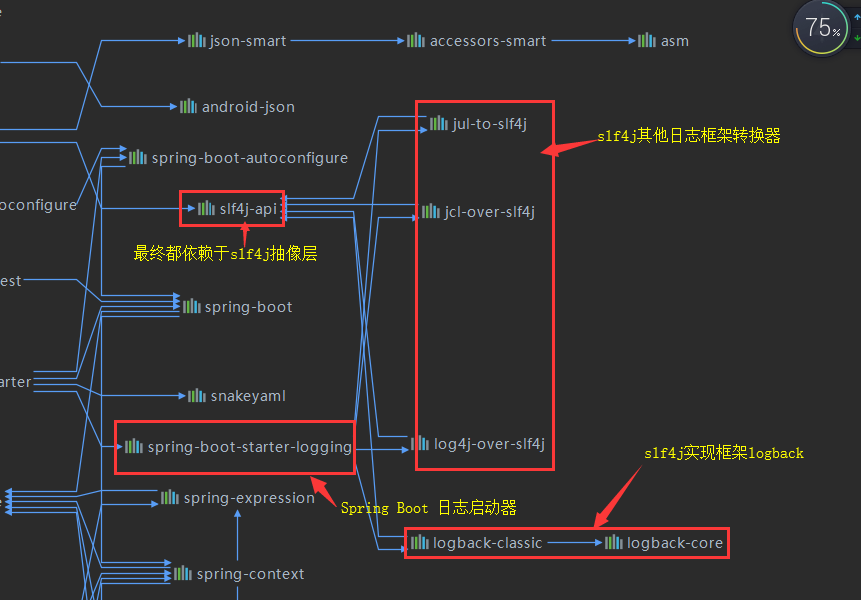
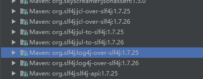
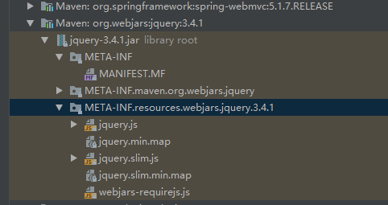
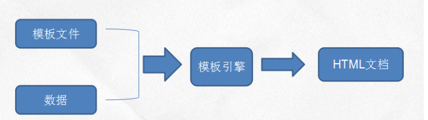
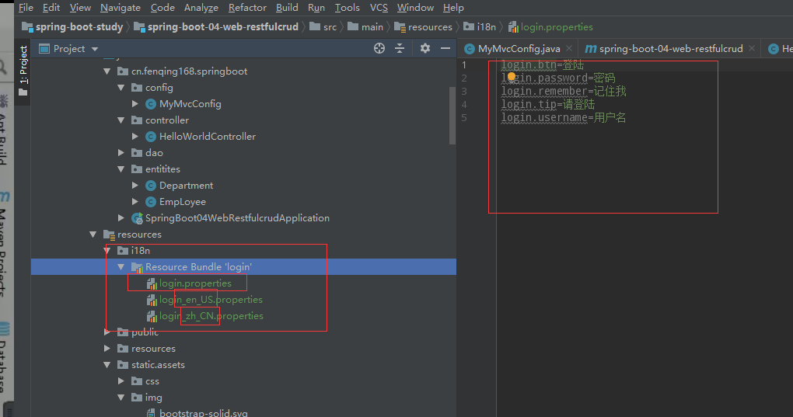
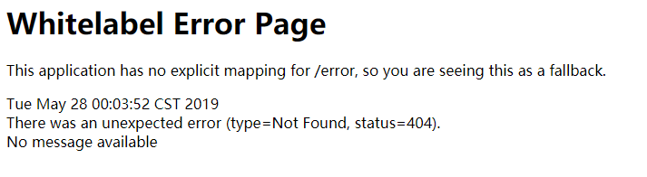

# @EnableAutoConfiguration一、Spring Boot 入门

## 1、Spring Boot简介
> * 简化Spring应用开发的一个框架;<br>
> * 整个Spring技术栈的一大整合; <br/>
> * J2EE开发的一站式解决方案; <br/>
## 2、微服务
> * 2014，martin fowler<br/><br/>
> * 微服务： 架构风格<br/><br/>
> * 一个应用应该是一组小型服务； 可以通过HTTP的方式进行互通；<br/>


> * 每一个功能元素最终都是一个可独立替换的和独立升级的软件单元；<br/>

> * [详细参照微服务文档](https://martinfowler.com/articles/microservices.html#MicroservicesAndSoa)

> * 环境约束<br/>
> * -Spring Boot 官方推荐jdk1.及级以上<br/>
> * -maven3.x maven3.3以上<br/>
> * -IntelliJIDEA<br/>
> * -SpringBoot 1.5.9.RELEASE<br/>

> * 统一环境

> * maven设置的settings.xml配置文件的profiles标签添加设置编译选择的jdk版本<br>
```xml
<profile>    
    <id>jdk-1.8</id>    
    <activation>    
          <activeByDefault>true</activeByDefault>    
          <jdk>1.8</jdk>    
      </activation>    
    <properties>    
        <maven.compiler.source>1.8</maven.compiler.source>    
        <maven.compiler.target>1.8</maven.compiler.target>    
        <maven.compiler.compilerVersion>1.8</maven.compiler.compilerVersion>    
    </properties>     
</profile>
```
## 4、Spring Boot HelloWorld
* 一个功能：
* 浏览器发送hello请求，服务器接收请求并处理，响应Hello World字符串

### 1、创建一个maven工程（jar）
### 2、导入依赖Spring Boot相关的依赖
```xml
    <!-- 继承springboot父工程 -->
    <parent>
        <groupId>org.springframework.boot</groupId>
        <artifactId>spring-boot-starter-parent</artifactId>
        <version>2.0.9.RELEASE</version>
    </parent>

    <!-- 添加web启动器依赖 -->
    <dependencies>
        <dependency>
            <groupId>org.springframework.boot</groupId>
            <artifactId>spring-boot-starter-web</artifactId>
        </dependency>
    </dependencies>
```
### 3、编写一个主程序；启动Spring Boot应用
```java
/**
 * @SpringBootApplication Spring Boot 标识注解，表明这个类是Spring Boot 主程序类
 */
@SpringBootApplication
public class HelloWorldMainApplication {


    public static void main(String[] args) {
        // 执行Spring boot应用
        SpringApplication.run(HelloWorldMainApplication.class, args);
    }

}
```
### 4、编写相关的Controller,Service 
```java
@Controller
public class HelloWorldController {

    @ResponseBody
    @GetMapping("/hello")
    public String hello(){
        return "Hello World";
    }

}
```
### 5、运行主程序测试
### 6、部署程序
```xml
    <!-- 用来给Spring Boot项目打包成可执行文件的maven插件 -->
    <build>
        <plugins>
            <plugin>
                <groupId>org.springframework.boot</groupId>
                <artifactId>spring-boot-maven-plugin</artifactId>
            </plugin>
        </plugins>
    </build>
```
> * 将这个应用打成可执行jar包

## 5、Hello World探究
### 1、POM文件
#### 1.父项目
```xml
    <!-- 继承springboot父工程 -->
    <parent>
        <groupId>org.springframework.boot</groupId>
        <artifactId>spring-boot-starter-parent</artifactId>
        <version>2.0.9.RELEASE</version>
    </parent>
```
> * 以及他的上一级父项目

```xml
  <parent>
    <groupId>org.springframework.boot</groupId>
    <artifactId>spring-boot-dependencies</artifactId>
    <version>2.0.9.RELEASE</version>
    <relativePath>../spring-boot-dependencies</relativePath>
  </parent>
```
> * 它充当全部可能用到的jar包依赖
> * 可以称为Spring Boot的版本仲裁
> * 大部分依赖可以不需要写版本号（没有在dependencies工程里面的依赖，还需手动声明版本号）

#### 2、导入的依赖
```xml
    <!-- 添加web启动器依赖 -->
    <dependencies>
        <dependency>
            <groupId>org.springframework.boot</groupId>
            <artifactId>spring-boot-starter-web</artifactId>
        </dependency>
    </dependencies>
```
> * spring-boot-starter:spring-boot场景启动器; 帮我们导入了web模块正常运行所依赖的组件；
> * Spring Boot 将所有的功能场景抽取出来，做成一个个starters（启动器）,只需要在项目里面引入这些starter相关场景的所有依赖都会导入进来，要用什么功能就导入什么场景的启动器

### 2、Spring Boot主程序类，入口类
```java
/**
 * @SpringBootApplication Spring Boot 标识注解，表明这个类是Spring Boot 主程序类
 */
@SpringBootApplication
public class HelloWorldMainApplication {


    public static void main(String[] args) {
        // 执行Spring boot应用
        SpringApplication.run(HelloWorldMainApplication.class, args);
    }

}
```
> * @**SpringBootApplication**: Spring Boot引用标注正在某个类上说明这个类是SpringBoot的主配置类， SpringBoot就应该运行这个类的main你方法来启动SpringBoot应用
```java
@SpringBootConfiguration
@EnableAutoConfiguration
@ComponentScan(
    excludeFilters = {@Filter(
    type = FilterType.CUSTOM,
    classes = {TypeExcludeFilter.class}
), @Filter(
    type = FilterType.CUSTOM,
    classes = {AutoConfigurationExcludeFilter.class}
)}
)
public @interface SpringBootApplication{}
```
> * @**SpringBootApplication**:Spring Boot的配置类；
>> * 标注在某个类上，表示这个是一个Spring Boot的配置类
>> * @**Configuration**:配置类上标注这个注解：
>>> * 配置类 ---> 配置文件；配置类也是容器中的组件@Component
> * @**EnableAutoConfiguration** Spring Boot 自动开启配置注解
>> * 以前我们需要配置的东西，Spring Boot帮我们自动配置； @**EnableAutoConfiguration**告诉我吗SpringBoot将开启自动配置功能；这样自动配置才能生效
```java
@AutoConfigurationPackage
@Import({AutoConfigurationImportSelector.class})
public @interface EnableAutoConfiguration {}
```
>> * @**AutoConfigurationPackage** 自动配置包
>>
>> * @Import({Registrar.class});
>>
>> * Spring的底层注解，@Import,给容器中导入一个组件；导入一个组件由Registrar.class
>>
>> * 将主配置陪（@SpringBootApplication ）的所在包下面的所有自雷所有组件扫描到Spring容器中
>>
>>   > ```java
>>   > @Import({AutoConfigurationImportSelector.class}) 
>>   > ```

> > >  给容器中导入组件？
> > >
> > > ```java
> > > AutoConfigurationImportSelector
> > > ```

> > > 导入哪些组件选择器；
> > >
> > > 将所需要导入的组件以全类名的方式返回，这些组件就会添加到容器中；
> > >
> > > 会给容器中导入非常多的自动配置类的（XXXConfiguration）；就是给容器中导入这个场景需要的所有组件，并配置好这些组件；
> > >
> > > 有了自动配置类，免去了手动编写配置注入功能组件的工作
> > > SpringFactoriesLoader.loadFactoryNames（EnableAutoConfiguration.class， classLoader）
> > >
> > > Spring Boot在启动的时候从类路径下的META-INF/spring.factories中获取EnableAutoConfiguration指定的值，将这些指定的值的自动配置类导入到容器中，自动配置了生效，帮我妈进行自动配置工作；以前我们需要自己配置的东西，自动配置类会将我们自动配置
> > >
> > > J2EE的整体整合方案都在spring-boot-autoconfigure-2.0.9.RELEASE.jar下

## 6、是用Spring Initializer快速创建Spring Boot项目

### 1.IDE都支持使用Spring的项目创建向导快速创建一个Spring Boot项目；

> 选择我们需要的模块，向导会帮我从互联网创建Spring Boot项目
>
> 默认生成的Spring Boot项目
>
> * 主程序已经生成好了，我们只要写我们的业务逻辑
> * resources文件夹的目录结构
> * static: 保存所有的静态资源；js css images
> * templates: 保存所有的模板页面；（Spring Boot 默认jar包使用嵌入式的tomcat，默然不支持jsp页面）；可以使用模板引擎（freemarker， thymeleaf）
> * application.properties:Spring Boot应用的配置文件；可以修改一些默认设置 

# 二、配置文件

## 1、配置文件

> SpringBoot使用一个全局的配置文件，配置文件是固定的；
>
> application.properties
>
> application.yml
>
> 配置文件的作用：修改SpringBoot自动配置的默认值；SpringBoot在底层给我们自动配置好；
>
> YAML(YAML Ain't Markup Language)
>
> > * YAML A Markup Language:是一个标记语言
>
> > * YAML isn't Markup Language：不是一个标记语言
>
> 标记语言：
>
> > * 以前的配置文件；大多都使用的是xxx.xml文件；
> >
> > * YAML：以数据为中心，比json、xml等更适合做配置文件
> >
> > * YAML:配置例子
> >
> > * ```yml
> >   server:
> >   	port:8081
> >   	```
> >```
> > 
> >* xml:
> > 
> >   * ```xml
> >   <server>
> >   	<prot>8081</prot>
> >   </server>
> >```
> >   

## 2、YAML语法

### 1、基本语法

> k:(空格)v：标识一堆键值对（空格必须有）
>
> 以空格的缩进来控制层级关系；只要是左对齐的一列数据，都是同一个层级的
>
> ```yml
> server:
>   port: 8081
>   path: /hello
> ```
>
> 属性和值是大小写敏感的

### 2、值的语法

> 字面量：普通的值（数字，字符串，布尔）
>
> > k:v ： 字面直接来写；
> >
> > > 字符串默认不用加上单引号 或者双引号
> > >
> > > "":双引号；不会转义字符串里面的特殊字符；特殊字符或作为本身想表示的意思
> > >
> > > > name:  "zhangsan \n lisi" : 输出: zhangsan 换行 lisi
> > >
> > > ''单引号；会总喜欢以特殊字符，特殊字符最终只是一个普通的字符串数据
> > >
> > > > name: 'zhangsan \n lisi' 输出：zhangsan \n lisi
>
> 对象，Map（属性和值）（j键值对）
>
> > k:v： 在下一行来写对象的属性和值的关系；注意缩进
> >
> > > 对象还是k:v 的方式
> > >
> > > ```yaml
> > > friends:
> > >   lastName: zhangsan
> > >   age: 20
> > > ```
> > >
> > > 行内写法
> > >
> > > ```yaml
> > > friends: {lastName: zhangsan, age: 18}
> > > ```
>
> 数组（List,Set）
>
> > 用- 值表示数组中的一个元素
> >
> > ```yaml
> > pets:
> >  - cat
> >  - dog
> >  - pig
> > ```
> >
> > 行内写法
> >
> > ```yaml
> > pets:[cat, dog, pig]
> > ```

## 3、获取配置文件注入

> 配置文件：
>
> ```yaml
> person:
>   lastName: zhangsan
>   age: 18
>   boss: false
>   birth: 2017/12/12
>   maps: {k1: v1, k2: v2}
>   lists:
>     - lisi
>     - zhaoliu
>   dog:
>     name: 小狗
>     age: 2
> ```
>
> java 代码：
>
> ```java
> /**
>  * 将配置文件中配置的每一个属性的值，映射到这个组件中
>  * @ConfigurationProperties: 告诉SpringBoot将本类中所有属性和配置文件中相关配置进行绑定；
>  * prefix = "person"：配置问文件中哪个下面的所有属性进行一一对应
>  *
>  * 只有这个组件是容器中的组件，才能容器提供的@ConfigurationProperties
>  */
> @Component
> @ConfigurationProperties(prefix = "person")
> public class Person {
> 
>     private String lastName;
> 
>     private Integer age;
> 
>     private Boolean boss;
> 
>     private Date birth;
> 
>     private Map<String, Object> maps;
>     private List<Object> lists;
>     private Dog dog;
> 
>     public String getLastName() {
>         return lastName;
>     }
> 
>     public void setLastName(String lastName) {
>         this.lastName = lastName;
>     }
> 
>     public Integer getAge() {
>         return age;
>     }
> 
>     public void setAge(Integer age) {
>         this.age = age;
>     }
> 
>     public Boolean getBoss() {
>         return boss;
>     }
> 
>     public void setBoss(Boolean boss) {
>         this.boss = boss;
>     }
> 
>     public Date getBirth() {
>         return birth;
>     }
> 
>     public void setBirth(Date birth) {
>         this.birth = birth;
>     }
> 
>     public Map<String, Object> getMaps() {
>         return maps;
>     }
> 
>     public void setMaps(Map<String, Object> maps) {
>         this.maps = maps;
>     }
> 
>     public List<Object> getLists() {
>         return lists;
>     }
> 
>     public void setLists(List<Object> lists) {
>         this.lists = lists;
>     }
> 
>     public Dog getDog() {
>         return dog;
>     }
> 
>     public void setDog(Dog dog) {
>         this.dog = dog;
>     }
> 
>     @Override
>     public String toString() {
>         return "Person{" +
>                 "lastName='" + lastName + '\'' +
>                 ", age=" + age +
>                 ", boss=" + boss +
>                 ", birth=" + birth +
>                 ", maps=" + maps +
>                 ", lists=" + lists +
>                 ", dog=" + dog +
>                 '}';
>     }
> }
> ```
>
> 我们可以导入一个配置文件处理器，以后编写就有提示
>
> ```xml
> <!--导入配置文件处理器，配置文件进行绑定就会有提示-->
> <dependency>
>     <groupId>org.springframework.boot</groupId>
>     <artifactId>spring-boot-configuration-processor</artifactId>
>     <optional>true</optional>
> </dependency>
> ```

### 1、proeprties配置文件在idea中默认是utf-8编码，中文可能会乱码

>  

### 2、@Value获取值和@ConfigurationProperties获取值比较

> |                      | @ConfigurationProperties | @Value     |
> | -------------------- | ------------------------ | ---------- |
> | 功能                 | 批量注入配置文件的属性   | 一个个指定 |
> | 松散绑定（松散语法） | 支持                     | 不支持     |
> | SpEL（表达式）       | 不支持                   | 支持       |
> | JSR303数据校验       | 支持                     | 不支持     |
> | 复杂类型封装         | 支持                     | 不支持     |
>
> 配置文件yml还是properties他们都能回去到值；
>
> * 如果我们只是在某个业务逻辑中需要获取一下配置文件中的某想值，就用@Value
> * 如果我们专门编写了一个javabean来和配置文件进行映射；则直接使用@ConfigurationProperties；

### 3、数据注入值校验

> ```java
> @Component
> @ConfigurationProperties(prefix = "person")
> @Validated
> public class Person {
> 
>     /**
>      * <bean class="Person">
>      *     <property name="lastName" value="字面量/${key}从环境变量，配置文件中获取值/#{SpEL}"></property>
>      * </bean>
>      */
>     //@Value("${person.last-name}")
>     /**
>      * lastName必须是邮箱
>      */
>     @Email
>     private String lastName;
> 
>     //@Value("#{11*2}")
>     private Integer age;
> 
>     //@Value("true")
>     private Boolean boss;
> 
>     private Date birth;
> 
>     private Map<String, Object> maps;
>     private List<Object> lists;
>     private Dog dog;
> }
> ```

### 4、@propertySource&@ImportResource

> @PropertySource:加载指定的配置文件
>
> > ```java
> > @PropertySource("classpath:person.properties")
> > @Component
> > @ConfigurationProperties(prefix = "person")
> > @Validated
> > public class Person {
> > 
> >     /**
> >      * <bean class="Person">
> >      *     <property name="lastName" value="字面量/${key}从环境变量，配置文件中获取值/#{SpEL}"></property>
> >      * </bean>
> >      */
> >     //@Value("${person.last-name}")
> >     /**
> >      * lastName必须是邮箱
> >      */
> >     //@Email
> >     private String lastName;
> > 
> >     //@Value("#{11*2}")
> >     private Integer age;
> > 
> >     //@Value("true")
> >     private Boolean boss;
> > 
> >     private Date birth;
> > 
> >     private Map<String, Object> maps;
> >     private List<Object> lists;
> >     private Dog dog;
> > }
> > ```
> >
> > 
>
> @ImportResource：导入Spring的配置文件，让配置文件里面的内容生效
>
> * Spring Boot 里面没有Spring的配置文件，我们自己编写的配置文件，也不能自动识别；
>
> * 想让我们SpringBoot识别Spring配置文件，需要在某个配置类上编写@ImportResource注解
>
> * ```java
>   @ImportResource(locations = {"classpath:beans.xml"})
>   @SpringBootApplication
>   public class SpringBoot02ConfigApplication {
>   ```
> ```
> 
> ```
>
> ```
> 
> ```
>
> ```
> 
> ```
>
> ```
> 
> public static void main(String[] args) {
> SpringApplication.run(SpringBoot02ConfigApplication.class, args);
> }
> ```
>
> }
> ```
> 
> Spring Boot推荐给容器添加组件的方式；
> 
> 不来使用配置文件方式
> 
> ​```xml
> <?xml version="1.0" encoding="UTF-8"?>
> <beans xmlns="http://www.springframework.org/schema/beans"
> xmlns:xsi="http://www.w3.org/2001/XMLSchema-instance"
> xsi:schemaLocation="http://www.springframework.org/schema/beans http://www.springframework.org/schema/beans/spring-beans.xsd">
> 
> <bean id="helloService" class="cn.fenqing168.springBoot.service.HelloService" />
> 
> </beans>
> ```
>
> 1.配置类========Spring配置文件
>
> 2.使用@Bean给容器中添加组件
>
> ```java
> /**
>    * @Configuration：当前类是一个配置类；就是来代替之前的Spring配置文件
> */
> @Configuration
> public class MyAppConfig {
>
> /**
>        * 将方法的返回值添加到容器中；容器中这个组件默认的id就是方法名
>        * @return
> */
> @Bean
> public HelloService helloService(){
> System.out.println("给容器中添加组件");
> return new HelloService();
> }
>
> }
>
> ```
> 
> ```
>
> ```
> 
> ```
>
> ```
> 
> ```
>
> ```
> 
> ```

## 4、配置文件占位符

### 1、随机数

> ```properties
> person.last-name=张三${random.uuid}
> person.age=${random.int}
> ```

### 2、站位父获取之前哦诶之的值，如果没有使用：指定默认值

> ```properties
> person.last-name=张三${random.uuid}
> person.age=${random.int}
> person.birth=2018/1/1
> person.boss=false
> person.lists=a,b,c
> person.maps.k1=v1
> person.maps.k2=v2
> person.dog.name=${person.hello:hello}dog
> person.dog.age=1
> ```

## 5、Profile

### 1、多Profile文件

> 我们在住配置文件编写的时候，文件名可以是application-{profile}.properties/yml
>
> 默认使用applicat.properties/yml

### 2、yml支持多文档快方式

> ```yaml
> server:
>   port: 8081
> 
> #person:
> #  lastName: zhangsan
> #  age: 18
> #  boss: false
> #  birth: 2017/12/12
> #  maps: {k1: v1, k2: v2}
> #  lists:
> #    - lisi
> #    - zhaoliu
> #  dog:
> #    name: 小狗
> #    age: 2
> spring:
>   profiles:
>     active: prod
> 
> ---
> server:
>   port: 8083
> spring:
>   profiles: dev
> 
> 
> ---
> server:
>   port: 8084
> 
> spring:
>    profiles: prod
> ```
>
> 

### 3、激活指定的profile

> 1、在配置文件中指定spring.profiles.active=dev

> 2、命令行方式：
>
> > --spring.profiles.active=dev（给main方法传递参数）
>
> > 也可以打成jar包，传递参数
> >
> > ```cmd
> > Java -jar spring-boot-02-config-0.0.1-SNAPSHOT.jar --spring.profiles.active=dev
> > ```
>
> 3、虚拟机参数
>
> ```cmd
> -Dspring.profiles.active=dev
> ```

## 6、配置文件加载位置

> spring boot 启动会扫描一下位置的application.properties或者application.yml文件作为Spring boot的默认配置文件
>
> -file:../config/
>
> -file../
>
> -classpath:/config/
>
> -classpath:/
>
> 优先级由高到低，高优先级的配置会覆盖低优先级的配置；
>
> SpringBoot会从这四个位置全部加载主配置文件；**互补配置**


> 我们还可以通过修改spring.config.location来修改默认的配置文件位置

> 项目大搞后，可以使用命令行参数的形式，启动项目的时候来指定配置文件的新位置；配置文件和默认配置文件共同作用互补配置（用作运维）

## 7、外部配置加载顺序

> SpringBoot也可以从以下位置加载配置；优先级从高到低；高优先级配置会覆盖优先级低的配置，不同的配置会互补

* 1.命令行参数

> java -jar spring-boot-02-config02-0.0.1-SNAPSHOT.jar --server.port=8888 多个参数用空格分来，参数前加--

* 2.来之java：comp/env的JNDI属性
* 3.Java系统属性（System.getProperties()）
* 4.操作系统环境变量
* 5.RandomValuePropertySource配置的random.*属性值
* 6.jar包外部的application-{profile}.properties或者application.yml(带spring.profile)配置文件
* 7.jar包内部的application-{profile}.properties或application.yml（带spring.profile）配置文件
* 8.jar外部的application-(profile).properties或者application.yml(不带spring.profile)配置文件
* 9.jar包内部的application-{profile}.properties或application.xml(不带spring.profile)配置文件
* 10.@Configuration注解上的@PropertySource
* 11.通过SpringApplication.setDefaultProperties指定的默认属性

> * 所有支持配置加载来源 [请查看官方文档](<https://docs.spring.io/spring-boot/docs/2.1.4.RELEASE/reference/htmlsingle/#boot-features-external-config>)

## 8、自动配置原理

### 1、自动配置原理

* 配置文件到底能写什么？怎么写？自动配置原理

  >  配置文件的配置属性参照
  >
  > [参照](<https://docs.spring.io/spring-boot/docs/2.1.4.RELEASE/reference/htmlsingle/#common-application-properties>)

* 自动配置原理

  * springBoot启动的时候加载了主配置陪。开启了自动配置功能@EnableAutoConfiguration

  * * @EnableAutoConfiguration

    * 利用选择器EnableAutoConfigurationImportSelector导入了一些组件

    * 可以查看selectImports()方法的内容；

    * ```java
      List<String> configurations = getCandidateConfigurations(annotationMetadata,
      					attributes);候选的配置
      ```

    * ```java
       SpringFactoriesLoader.loadFactoryNames()
           扫描所有jar包类路径下的META-INF/spring.factories
           吧扫描的这些文件的内容包装成properties对象
           从properties中获取到EnableAutoConfiguration.class类（类名）对应的值，然后把他添加到容器中
      ```

    * 总结：将类路径下 META-INF/spring.factories里面配置的所有的EnableAutoConfiguration的值添加入容器中

    * > ```properties
      > # Auto Configuration Import Listeners
      > org.springframework.boot.autoconfigure.AutoConfigurationImportListener=\
      > org.springframework.boot.autoconfigure.condition.ConditionEvaluationReportAutoConfigurationImportListener
      > 
      > # Auto Configuration Import Filters
      > org.springframework.boot.autoconfigure.AutoConfigurationImportFilter=\
      > org.springframework.boot.autoconfigure.condition.OnClassCondition
      > 
      > # Auto Configure
      > org.springframework.boot.autoconfigure.EnableAutoConfiguration=\
      > org.springframework.boot.autoconfigure.admin.SpringApplicationAdminJmxAutoConfiguration,\
      > org.springframework.boot.autoconfigure.aop.AopAutoConfiguration,\
      > org.springframework.boot.autoconfigure.amqp.RabbitAutoConfiguration,\
      > org.springframework.boot.autoconfigure.batch.BatchAutoConfiguration,\
      > org.springframework.boot.autoconfigure.cache.CacheAutoConfiguration,\
      > org.springframework.boot.autoconfigure.cassandra.CassandraAutoConfiguration,\
      > org.springframework.boot.autoconfigure.cloud.CloudAutoConfiguration,\
      > org.springframework.boot.autoconfigure.context.ConfigurationPropertiesAutoConfiguration,\
      > org.springframework.boot.autoconfigure.context.MessageSourceAutoConfiguration,\
      > org.springframework.boot.autoconfigure.context.PropertyPlaceholderAutoConfiguration,\
      > org.springframework.boot.autoconfigure.couchbase.CouchbaseAutoConfiguration,\
      > org.springframework.boot.autoconfigure.dao.PersistenceExceptionTranslationAutoConfiguration,\
      > org.springframework.boot.autoconfigure.data.cassandra.CassandraDataAutoConfiguration,\
      > org.springframework.boot.autoconfigure.data.cassandra.CassandraRepositoriesAutoConfiguration,\
      > org.springframework.boot.autoconfigure.data.couchbase.CouchbaseDataAutoConfiguration,\
      > org.springframework.boot.autoconfigure.data.couchbase.CouchbaseRepositoriesAutoConfiguration,\
      > org.springframework.boot.autoconfigure.data.elasticsearch.ElasticsearchAutoConfiguration,\
      > org.springframework.boot.autoconfigure.data.elasticsearch.ElasticsearchDataAutoConfiguration,\
      > org.springframework.boot.autoconfigure.data.elasticsearch.ElasticsearchRepositoriesAutoConfiguration,\
      > org.springframework.boot.autoconfigure.data.jpa.JpaRepositoriesAutoConfiguration,\
      > org.springframework.boot.autoconfigure.data.ldap.LdapDataAutoConfiguration,\
      > org.springframework.boot.autoconfigure.data.ldap.LdapRepositoriesAutoConfiguration,\
      > org.springframework.boot.autoconfigure.data.mongo.MongoDataAutoConfiguration,\
      > org.springframework.boot.autoconfigure.data.mongo.MongoRepositoriesAutoConfiguration,\
      > org.springframework.boot.autoconfigure.data.neo4j.Neo4jDataAutoConfiguration,\
      > org.springframework.boot.autoconfigure.data.neo4j.Neo4jRepositoriesAutoConfiguration,\
      > org.springframework.boot.autoconfigure.data.solr.SolrRepositoriesAutoConfiguration,\
      > org.springframework.boot.autoconfigure.data.redis.RedisAutoConfiguration,\
      > org.springframework.boot.autoconfigure.data.redis.RedisRepositoriesAutoConfiguration,\
      > org.springframework.boot.autoconfigure.data.rest.RepositoryRestMvcAutoConfiguration,\
      > org.springframework.boot.autoconfigure.data.web.SpringDataWebAutoConfiguration,\
      > org.springframework.boot.autoconfigure.elasticsearch.jest.JestAutoConfiguration,\
      > org.springframework.boot.autoconfigure.freemarker.FreeMarkerAutoConfiguration,\
      > org.springframework.boot.autoconfigure.gson.GsonAutoConfiguration,\
      > org.springframework.boot.autoconfigure.h2.H2ConsoleAutoConfiguration,\
      > org.springframework.boot.autoconfigure.hateoas.HypermediaAutoConfiguration,\
      > org.springframework.boot.autoconfigure.hazelcast.HazelcastAutoConfiguration,\
      > org.springframework.boot.autoconfigure.hazelcast.HazelcastJpaDependencyAutoConfiguration,\
      > org.springframework.boot.autoconfigure.info.ProjectInfoAutoConfiguration,\
      > org.springframework.boot.autoconfigure.integration.IntegrationAutoConfiguration,\
      > org.springframework.boot.autoconfigure.jackson.JacksonAutoConfiguration,\
      > org.springframework.boot.autoconfigure.jdbc.DataSourceAutoConfiguration,\
      > org.springframework.boot.autoconfigure.jdbc.JdbcTemplateAutoConfiguration,\
      > org.springframework.boot.autoconfigure.jdbc.JndiDataSourceAutoConfiguration,\
      > org.springframework.boot.autoconfigure.jdbc.XADataSourceAutoConfiguration,\
      > org.springframework.boot.autoconfigure.jdbc.DataSourceTransactionManagerAutoConfiguration,\
      > org.springframework.boot.autoconfigure.jms.JmsAutoConfiguration,\
      > org.springframework.boot.autoconfigure.jmx.JmxAutoConfiguration,\
      > org.springframework.boot.autoconfigure.jms.JndiConnectionFactoryAutoConfiguration,\
      > org.springframework.boot.autoconfigure.jms.activemq.ActiveMQAutoConfiguration,\
      > org.springframework.boot.autoconfigure.jms.artemis.ArtemisAutoConfiguration,\
      > org.springframework.boot.autoconfigure.flyway.FlywayAutoConfiguration,\
      > org.springframework.boot.autoconfigure.groovy.template.GroovyTemplateAutoConfiguration,\
      > org.springframework.boot.autoconfigure.jersey.JerseyAutoConfiguration,\
      > org.springframework.boot.autoconfigure.jooq.JooqAutoConfiguration,\
      > org.springframework.boot.autoconfigure.kafka.KafkaAutoConfiguration,\
      > org.springframework.boot.autoconfigure.ldap.embedded.EmbeddedLdapAutoConfiguration,\
      > org.springframework.boot.autoconfigure.ldap.LdapAutoConfiguration,\
      > org.springframework.boot.autoconfigure.liquibase.LiquibaseAutoConfiguration,\
      > org.springframework.boot.autoconfigure.mail.MailSenderAutoConfiguration,\
      > org.springframework.boot.autoconfigure.mail.MailSenderValidatorAutoConfiguration,\
      > org.springframework.boot.autoconfigure.mobile.DeviceResolverAutoConfiguration,\
      > org.springframework.boot.autoconfigure.mobile.DeviceDelegatingViewResolverAutoConfiguration,\
      > org.springframework.boot.autoconfigure.mobile.SitePreferenceAutoConfiguration,\
      > org.springframework.boot.autoconfigure.mongo.embedded.EmbeddedMongoAutoConfiguration,\
      > org.springframework.boot.autoconfigure.mongo.MongoAutoConfiguration,\
      > org.springframework.boot.autoconfigure.mustache.MustacheAutoConfiguration,\
      > org.springframework.boot.autoconfigure.orm.jpa.HibernateJpaAutoConfiguration,\
      > org.springframework.boot.autoconfigure.reactor.ReactorAutoConfiguration,\
      > org.springframework.boot.autoconfigure.security.SecurityAutoConfiguration,\
      > org.springframework.boot.autoconfigure.security.SecurityFilterAutoConfiguration,\
      > org.springframework.boot.autoconfigure.security.FallbackWebSecurityAutoConfiguration,\
      > org.springframework.boot.autoconfigure.security.oauth2.OAuth2AutoConfiguration,\
      > org.springframework.boot.autoconfigure.sendgrid.SendGridAutoConfiguration,\
      > org.springframework.boot.autoconfigure.session.SessionAutoConfiguration,\
      > org.springframework.boot.autoconfigure.social.SocialWebAutoConfiguration,\
      > org.springframework.boot.autoconfigure.social.FacebookAutoConfiguration,\
      > org.springframework.boot.autoconfigure.social.LinkedInAutoConfiguration,\
      > org.springframework.boot.autoconfigure.social.TwitterAutoConfiguration,\
      > org.springframework.boot.autoconfigure.solr.SolrAutoConfiguration,\
      > org.springframework.boot.autoconfigure.thymeleaf.ThymeleafAutoConfiguration,\
      > org.springframework.boot.autoconfigure.transaction.TransactionAutoConfiguration,\
      > org.springframework.boot.autoconfigure.transaction.jta.JtaAutoConfiguration,\
      > org.springframework.boot.autoconfigure.validation.ValidationAutoConfiguration,\
      > org.springframework.boot.autoconfigure.web.DispatcherServletAutoConfiguration,\
      > org.springframework.boot.autoconfigure.web.EmbeddedServletContainerAutoConfiguration,\
      > org.springframework.boot.autoconfigure.web.ErrorMvcAutoConfiguration,\
      > org.springframework.boot.autoconfigure.web.HttpEncodingAutoConfiguration,\
      > org.springframework.boot.autoconfigure.web.HttpMessageConvertersAutoConfiguration,\
      > org.springframework.boot.autoconfigure.web.MultipartAutoConfiguration,\
      > org.springframework.boot.autoconfigure.web.ServerPropertiesAutoConfiguration,\
      > org.springframework.boot.autoconfigure.web.WebClientAutoConfiguration,\
      > org.springframework.boot.autoconfigure.web.WebMvcAutoConfiguration,\
      > org.springframework.boot.autoconfigure.websocket.WebSocketAutoConfiguration,\
      > org.springframework.boot.autoconfigure.websocket.WebSocketMessagingAutoConfiguration,\
      > org.springframework.boot.autoconfigure.webservices.WebServicesAutoConfiguration
      > 
      > # Failure analyzers
      > org.springframework.boot.diagnostics.FailureAnalyzer=\
      > org.springframework.boot.autoconfigure.diagnostics.analyzer.NoSuchBeanDefinitionFailureAnalyzer,\
      > org.springframework.boot.autoconfigure.jdbc.DataSourceBeanCreationFailureAnalyzer,\
      > org.springframework.boot.autoconfigure.jdbc.HikariDriverConfigurationFailureAnalyzer
      > 
      > # Template availability providers
      > org.springframework.boot.autoconfigure.template.TemplateAvailabilityProvider=\
      > org.springframework.boot.autoconfigure.freemarker.FreeMarkerTemplateAvailabilityProvider,\
      > org.springframework.boot.autoconfigure.mustache.MustacheTemplateAvailabilityProvider,\
      > org.springframework.boot.autoconfigure.groovy.template.GroovyTemplateAvailabilityProvider,\
      > org.springframework.boot.autoconfigure.thymeleaf.ThymeleafTemplateAvailabilityProvider,\
      > org.springframework.boot.autoconfigure.web.JspTemplateAvailabilityProvider
      > 
      > ```
      >
      > 每一个类名都是某个在容器的组件，都加入到容器里，用他们来做自动配置

    * 每一个自动配置类，来自动配置

    * 以HttpEncodingAutoConfiguration为例子，解释自动配置

    * ```java
       
      @Configuration//表示一个配置类，以前编写配置文件一样，也可以给容器中添加组件
      @EnableConfigurationProperties(HttpEncodingProperties.class)//启动ConfigurationProperties功能，将配置文件中对应的值和HttpEncodingProperties绑定起来
      @ConditionalOnWebApplication //spring底层@Conditional注解，根据不同的条件，如果满足指定条件，整个配置类里的配置才会生效，判断当前应用示范是web应用，如果是，当前配置类生效
      @ConditionalOnClass(CharacterEncodingFilter.class)//判断当前项目有没有CharacterEncodingFilter类，是springmvc的乱码解决过滤器
      @ConditionalOnProperty(prefix = "spring.http.encoding，", value = "enabled",
      		matchIfMissing = true)//判断配置文件示范存在某个配置，如果存在spring.http.encoding，如果不存在如果不存在enabled也是生效的
      public class HttpEncodingAutoConfiguration {
          /**
         	 * 它已经和SpringBoot的配置文件映射了
         	 **/
          private final HttpEncodingProperties properties;
          
           /**
         	 * 只有一个有参构造器，参数的值会从容器中拿
         	 **/
          public HttpEncodingAutoConfiguration(HttpEncodingProperties properties) {
      		this.properties = properties;
      	}
          
       	@Bean //给容器中添加一个组件，这个组件会从properties属性中拿
      	@ConditionalOnMissingBean(CharacterEncodingFilter.class)
      	public CharacterEncodingFilter characterEncodingFilter() {
      		CharacterEncodingFilter filter = new OrderedCharacterEncodingFilter();
      		filter.setEncoding(this.properties.getCharset().name());
      					                  	           filter.setForceRequestEncoding(this.properties.shouldForce(Type.REQUEST));
      		filter.setForceResponseEncoding(this.properties.shouldForce(Type.RESPONSE));
      		return filter;
      	}
      ```

      根据当前不同的条件判断，决定这些配置类是否生效

      一旦这个配置生效；这个配置类就会给容器就会给容器中添加各种组件，这些组件的属性从对象properties类中获取的，这些类里面的每一个属性有事和配置文件绑定的

    * ```java
      @ConfigurationProperties(prefix = "spring.http.encoding")//从配置文件中获取指定的值和bean的属性进行绑定
      public class HttpEncodingProperties {
      ```

    * 所有在配置文件中，你能在配置文件中配置的属性，都是在xxxProperties类中封装的；配置文件能配置什么可以参照某个功能对应的这个属性类

    * 精髓：

    * * springBoot启动会加载大量的自动配置类
      * 我们看我们需要的功能有没有SpringBoot默认写好的自动配置类
      * 我们再来看这个自动配置类中到底配置那些组件（只要我们要用的组件由，就不需要再来配置）
      * 给容器中自动配置类添加组件的时候，会从properties类中获取某些属性，我们就可以在配置文件中指定这些属性的值
      * xxxxAutoConfigurartion自动配置类
      * 给容器中添加组件，properties会从配置文件中读取配置信息


### 2、细节

#### 1、@Conditional派生注解（Spring注解版原生的@Conditional作用）

* 作用：必须是@Conditional指派的条件成立，才给容器中添加组件，配置裴黎明的所有内容才生效

| @Conditional                    | 作用（判断是否满足当前条件）                     |
| ------------------------------- | ------------------------------------------------ |
| @ConditionalOnJava              | 系统的java版本是否符合要求                       |
| @ConditionalOnBean              | 容器中存在指定Bean                               |
| @ConditionalOnMissingBean       | 容器中不存在指定Bean                             |
| @ConditionalOnExpression        | 满足SpEL表达式指定                               |
| @ConditionalOnClass             | 系统中有指定的类                                 |
| @ConditionalMissingClass        | 系统中没有指定的类                               |
| @ConditionalOnSingleCandidate   | 容器中只有一个指定的Bean，或者这个Bean是首选Bean |
| @ConditionalOnProperty          | 系统中指定的属性是否有指定的值                   |
| @ConditionalOnResoures          | 类路径下是否存在指定的资源文件                   |
| @ConditionalOnWebApplication    | 当前是web环境                                    |
| @ConditionalOnNotWebApplication | 当前不是web环境                                  |
| @ConditionalOnJndi              | JNDI存在指定项                                   |

自动配置类必须在一定的条件下才能生效

我们怎么知道配置类生效；

我们可以通过启动 debug=true属性； 来让控制台打印自动配置报告，这样我们就可以很方便的知道哪些自动配置类生效；

```java
=========================
AUTO-CONFIGURATION REPORT
=========================


Positive matches:(自动配置类启动的	)
-----------------

   DispatcherServletAutoConfiguration matched:
      - @ConditionalOnClass found required class 'org.springframework.web.servlet.DispatcherServlet'; @ConditionalOnMissingClass did not find unwanted class (OnClassCondition)
      - @ConditionalOnWebApplication (required) found 'session' scope (OnWebApplicationCondition)
Negative matches:
-----------------

   ActiveMQAutoConfiguration:（没有启动和没有	启动成功的）
      Did not match:
         - @ConditionalOnClass did not find required classes 'javax.jms.ConnectionFactory', 'org.apache.activemq.ActiveMQConnectionFactory' (OnClassCondition)

   AopAutoConfiguration:
      Did not match:
         - @ConditionalOnClass did not find required classes 'org.aspectj.lang.annotation.Aspect', 'org.aspectj.lang.reflect.Advice' (OnClassCondition)

   ArtemisAutoConfiguration:
      Did not match:
         - @ConditionalOnClass did not find required classes 'javax.jms.ConnectionFactory', 'org.apache.activemq.artemis.jms.client.ActiveMQConnectionFactory' (OnClassCondition)
```

# 三、日志

## 1、日志框架

* 小张；开发一个大型系统；

* 1.System.out.println("");将关键的数据打印在控制台；去掉？写在一个文件？

* 框架来记录系统的一些运行时信息；日志框架；zhanglogging.jar;

* 高大上的功能?异步模式？自动归档？xxx？zhanglogging-good.jar?

* 将以前的框架卸下来？换上新的框架，重新修改之前相关的API；zhanglogging-prefect.jar

* JDBC----数据库驱动

* * 写了一个统一的接口层，日志门面（日志的一个抽象层）；logging-abstract.jar
  * 给项目中导入具体的日志实现就行了；我们的之前的日志框架都是实现的抽象层

* 市面上的日志框架

* JUL,JCL,Jboss-logging,logback，log4j,log4j2,slf4j...

* | 日志门面(日志的抽象层)                                       | 日志实现                                    |
  | ------------------------------------------------------------ | ------------------------------------------- |
  | ~~JCL(Jakarta Commons Logging)~~ SLF4J(Simple Logging Facade for Java) ~~jboss-logging~~ | Log4j JUl(java.util.logging) Log4j2 Logback |

* 左边选一个门面（抽象层），右边选一个实现；

日志门面 ： SLF4j;

日志实现：Logback


Spring Boot 底层使用Spring框架，Spring框架默认是JCL;

SpringBoot选用的是SLF4j和Logback

## 2、SLF4j使用

### 1、如何在系统中使用SLF4j

* 在开发的时候，日志记录方法的调用，不应该来直接调用日志的实现类，而知调用日志抽象层里面的方法

* 应该给系统导入SLF4j的jar和logback的实现jar

* ```java
  public class HelloWorld {
    public static void main(String[] args) {
      Logger logger = LoggerFactory.getLogger(HelloWorld.class);
      logger.info("Hello World");
    }
  }
  ```

* 

每一个日志的实现框架都有自己的配置文件，使用slf4j以后，配置文件还是做成日志实现框架自己本身的配置文件

### 2、遗留问题

* a(slf4j + logback) Spring（commons-logging），Hibernate(jboss-logging)，MyBatis，xxx
* 统一日志记录，及时是别的框架和我一起统一使用slf4j进行


* 如何让系统中所有的日志都统一到slf4j
* * 将系统中其他日志框架先排除出去
  * 用中间包来替换原来的日志框架
  * 我们导入slf4j其他的实现

### 3、SpringBoot日志管理

```xml
<dependency>
    <groupId>org.springframework.boot</groupId>
    <artifactId>spring-boot-starter</artifactId>
    <version>2.1.5.RELEASE</version>
    <scope>compile</scope>
</dependency>
```

* SpringBoot日志启动器

```xml
<dependency>
    <groupId>org.springframework.boot</groupId>
    <artifactId>spring-boot-starter-logging</artifactId>
    <version>2.1.5.RELEASE</version>
    <scope>compile</scope>
</dependency>
```

* 

* 总结

* * SpingBoot底层也是使用slf4j+logback的方式进行日志记录

  * SpringBoot也把其他的日志都替换成了slf4j;

  * 中间替换包？

  * ```java
    @SuppressWarnings("rawtypes")
    public abstract class LogFactory {
    
        static String UNSUPPORTED_OPERATION_IN_JCL_OVER_SLF4J = "http://www.slf4j.org/codes.html#unsupported_operation_in_jcl_over_slf4j";
    
        static LogFactory logFactory = new SLF4JLogFactory();
    ```

  * 

  * 如果我们要引入其他框架？一定要把这个框架的默认日志依赖移除掉？

  * Spring 框架默认使用commons-logging

  * ```xml
    <dependency>
        <groupId>org.springframework</groupId>
        <artifactId>spring-core</artifactId>
        <exclusions>
            <exclusion>
                <groupId>commons-logging</groupId>
                <artifactId>commons-logging</artifactId>
            </exclusion>
        </exclusions>
    </dependency>
    ```

  * SpringBoot能自动适配所有的日志，而且底层使用slf4j+logback的方式记录日志，引入其他框架的时候，只需要把这个框架爱依赖的日志框架排除掉

## 四、日志使用

### 1、默认配置

* SpringBoot默认帮我们配置好了日志；

* ```java
  Logger logger = LoggerFactory.getLogger(getClass());
  
      @Test
      public void contextLoads() {
  
          //由低到高 trace< debug< info < warn < error
          //可以调节输出的日志级别；日志就会在这个级别以后的高级别生效
          logger.trace("这是tracer日志...");
          logger.debug("这是debug日志...");
          //springBoot默认调节的是info级别的,没有指定别的就用SpringBoot默认规定的级别：root级别
          logger.info("这是info日志...");
          logger.warn("这是warn日志...");
          logger.error("这是error日志...");
  
      }
  ```

* ```xml
  <!--
  	日志输出格式:
  		%d表示日期时间
  		@thread表示线程名
  		%-5level：级别从左显示5个字符宽度
  		%logger{50}： 表示logger名字最长50个字符，否则按照句点分割。
  		%msg: 日志消息
  		%n是换行符
  -->
  %d{yyyy-MM-dd HH:mm:ss:SSS} [%thread] %-5level %logger{50} - %msg%n
  ```

* spring boot修改日志的默认配置

```properties
logging.level.cn.fenqing168=trace
# 当前项目下生成springboot.log
#logging.file=springboot.log

# 指定完整路劲
#logging.file=E://springboot.log

# 指定路劲，在当前磁盘更目录下创建spring文件夹河里面的log文件夹，使用spring.log作为默认文件
logging.path=/spring/log

# 在控制台输出的日志格式
logging.pattern.console=%d{yyyy-MM-dd} ==== [%thread] == %5level %logger{50} -- %msg%n
# 指定文件输出的格式
logging.pattern.file=%d{yyyy-MM-dd} ==== [%thread] == %5level %logger{50} -- %msg%n


```

### 2、指定配置

* 给类路径下放上每个日志框架自己的配置文件即可，springboot就不使用自己的默认配置文件

* | Logging System          | Customization                                                |
  | ----------------------- | ------------------------------------------------------------ |
  | Logback                 | `logback-spring.xml`, `logback-spring.groovy`, `logback.xml`, or `logback.groovy` |
  | Log4j2                  | `log4j2-spring.xml` or `log4j2.xml`                          |
  | JDK (Java Util Logging) | `logging.properties`                                         |

logback.xml：直接被日志框架识别了

logback-spring.xml：日志框架就不直接加载日志的配置项，由SpringBoot加载,可以使用SpringBoot的功能

```xml
<springProfile name="staging">
    <!-- configuration to be enabled when the "staging" profile is active -->
    某段配置只在某段环境下生效
</springProfile>
```

slf4j+log4j

```xml
<dependency>
    <groupId>org.springframework.boot</groupId>
    <artifactId>spring-boot-starter-web</artifactId>
    <exclusions>
        <exclusion>
            <artifactId>logback-classic</artifactId>
            <groupId>ch.qos.logback</groupId>
        </exclusion>
        <exclusion>
            <artifactId>log4j-over-slf4j</artifactId>
            <groupId>org.slf4j</groupId>
        </exclusion>
    </exclusions>
</dependency>

<dependency>
    <groupId>org.slf4j</groupId>
    <artifactId>slf4j-log4j12</artifactId>
</dependency>
```

切换到log4j2

* 排除start-logging
* 添加start-log4g2

# 四、Web开发

* 使用SpringBoot

* * 创建SpringBoot应用，选中需要的模块；
  * SpringBoot已经默认将这些场景配置好，只需要在配置文件中配置销量配置就可以运行起来
  * 自己编写业务代码

* 自动配置原理

* * 这个场景SpringBoot帮我们配置了什么，能不能修改？能修改哪些配置，能不能扩展？

  * ```java
    xxxAutoConfiguration帮我们给容器中自动配置组件
    xxxProperties:配置类，封装配置文件的内容；
    ```

## 2、springBoot静态文件映射规则

* ```java
  @ConfigurationProperties(prefix = "spring.resources", ignoreUnknownFields = false)
  public class ResourceProperties implements ResourceLoaderAware, InitializingBean {
      //可以设置静态资源有关的参数
  ```

* 

* ```
  @Override
  public void addResourceHandlers(ResourceHandlerRegistry registry) {
  if (!this.resourceProperties.isAddMappings()) {
  logger.debug("Default resource handling disabled");
  return;
  }
  Integer cachePeriod = this.resourceProperties.getCachePeriod();
  if (!registry.hasMappingForPattern("/webjars/**")) {
  customizeResourceHandlerRegistration(registry
  .addResourceHandler("/webjars/**")
  .addResourceLocations("classpath:/META-INF/resources/webjars/")
  .setCachePeriod(cachePeriod));
  }
  String staticPathPattern = this.mvcProperties.getStaticPathPattern();
  if (!registry.hasMappingForPattern(staticPathPattern)) {
  customizeResourceHandlerRegistration(
  registry.addResourceHandler(staticPathPattern)
  .addResourceLocations(
  this.resourceProperties.getStaticLocations())
  .setCachePeriod(cachePeriod));
  }
  }
  
  //配置欢迎页面设置
  @Bean
  public WelcomePageHandlerMapping welcomePageHandlerMapping(
  ResourceProperties resourceProperties) {
  return new WelcomePageHandlerMapping(resourceProperties.getWelcomePage(),
  this.mvcProperties.getStaticPathPattern());
  }
  
  //喜欢的图标
  @Configuration
  @ConditionalOnProperty(value = "spring.mvc.favicon.enabled",
  matchIfMissing = true)
  public static class FaviconConfiguration {
  
  private final ResourceProperties resourceProperties;
  
  public FaviconConfiguration(ResourceProperties resourceProperties) {
  this.resourceProperties = resourceProperties;
  }
  
  @Bean
  public SimpleUrlHandlerMapping faviconHandlerMapping() {
  SimpleUrlHandlerMapping mapping = new SimpleUrlHandlerMapping();
  mapping.setOrder(Ordered.HIGHEST_PRECEDENCE + 1);
  //把所有的 **/favicon.ico 都映射到
  mapping.setUrlMap(Collections.singletonMap("**/favicon.ico",
  faviconRequestHandler()));
  return mapping;
  }
  
  @Bean
  public ResourceHttpRequestHandler faviconRequestHandler() {
  ResourceHttpRequestHandler requestHandler = new ResourceHttpRequestHandler();
  requestHandler
  .setLocations(this.resourceProperties.getFaviconLocations());
  return requestHandler;
  }
  
  }
  ```

* 所有/webjars/**，都去classpath:/META-INF/resoutces/webjars 找资源

* * webjars:以jar包的方式引入静态资源 [资料](<https://www.webjars.org/>

  * 

  * localhost:8080/webjars/jquery/3.3.1/jquery.js

  * ```xml
    <!--        webjars-->映入js引入资源就可以了
            <dependency>
                <groupId>org.webjars</groupId>
                <artifactId>jquery</artifactId>
                <version>3.4.1</version>
            </dependency>
    ```

  * 

* * ```
    "/**" 当前项目的任何资源
    ```

  * ```java
    "classpath:/META-INF/resources/", 
    "classpath:/resources/",
    "classpath:/static/", 
    "classpath:/public/"
    "/" 当先项目根目录    
    ```

  * localhost:8080/abc === 去静态资源文件夹找abc

* 欢迎页；静态资源文件夹下的所有index.html页面；被"/**"映射

* localhost:8080/ 找index.html

* 所有的 **/favicon.ico 都映射到都是在静态资源文件夹下找

### 3、模板引擎

* JSP, Velocity, Freemarker, Thymeleaf
* 
* SpringBoot 推荐的Thymeleaf；
* 语法更简单，功能更强大


#### 1、引入Thymeleaf；

```xml
<dependency>
    <groupId>org.springframework.boot</groupId>
    <artifactId>spring-boot-starter-thymeleaf</artifactId>
</dependency>
切换 thymeleaf版本
<thymeleaf.version>3.0.11.RELEASE</thymeleaf.version>
<!-- 布局功能的支持程序 thymeleaf主程序 layout2以上版本 -->
<!-- thymeleaf2 和  layout1-->
<thymeleaf-layout-dialect.version>2.1.1</thymeleaf-layout-dialect.version>
```

#### 2、Thymeleaf使用&语法

```java
@ConfigurationProperties(prefix = "spring.thymeleaf")
public class ThymeleafProperties {

	private static final Charset DEFAULT_ENCODING = StandardCharsets.UTF_8;

	public static final String DEFAULT_PREFIX = "classpath:/templates/";

	public static final String DEFAULT_SUFFIX = ".html";
    //
```

* 只要我们把html页面放在templates里边，thymeleaf就能帮我们自动渲染了

* 使用

* * 导入thymeleaf命名空间

  * ```html
    <html lang="en" xmlns:th="http://www.thymeleaf.org">
    ```

  * 使用thymeleaf语法

  * ```html
    <!DOCTYPE html>
    <html lang="en" xmlns:th="http://www.thymeleaf.org">
    <head>
        <meta charset="UTF-8">
        <title>成功</title>
    </head>
    <body>
        <h1>成功</h1>
        <!--th:text,将div里面的文本内容设置为-->
        <div th:text="${hello}">这是现实欢迎信息</div>
    </body>
    </html>
    ```

#### 3、语法规则

* th:text 改变当前元素里面的文本内容；

* th:任意html属性，来替换原生属性的值

* 

* 表达式

* ```properties
  Simple expressions:(表达式语法)
      Variable Expressions: ${...}：获取变量值；OGNL
      	1）、获取对象的属性，调用方法
      	2）、内置对象
      	#ctx : the context object.
          #vars: the context variables.
          #locale : the context locale.
          #request : (only in Web Contexts) the HttpServletRequest object.
          #response : (only in Web Contexts) the HttpServletResponse object.
          #session : (only in Web Contexts) the HttpSession object.
          #servletContext : (only in Web Contexts) the ServletContext object.
          
          ${session.foo}
          
          3）、内置工具对象：
          #execInfo : information about the template being processed.
          #messages : methods for obtaining externalized messages inside variables expressions, in the same way as they
          would be obtained using #{…} syntax.
          #uris : methods for escaping parts of URLs/URIs
          Page 20 of 106#conversions : methods for executing the configured conversion service (if any).
          #dates : methods for java.util.Date objects: formatting, component extraction, etc.
          #calendars : analogous to #dates , but for java.util.Calendar objects.
          #numbers : methods for formatting numeric objects.
          #strings : methods for String objects: contains, startsWith, prepending/appending, etc.
          #objects : methods for objects in general.
          #bools : methods for boolean evaluation.
          #arrays : methods for arrays.
          #lists : methods for lists.
          #sets : methods for sets.
          #maps : methods for maps.
          #aggregates : methods for creating aggregates on arrays or collections.
          #ids : methods for dealing with id attributes that might be repeated (for example, as a result of an iteration)
          
      Selection Variable Expressions: *{...}：变量选择表达式：和${}功能是一样的；
      	补充：配合 th:object="${session.user}"
      	<div th:object="${session.user}">
              <p>Name: <span th:text="*{firstName}">Sebastian</span>.</p>
              <p>Surname: <span th:text="*{lastName}">Pepper</span>.</p>
              <p>Nationality: <span th:text="*{nationality}">Saturn</span>.</p>
          </div>
      Message Expressions: #{...}：获取国际化内容
      Link URL Expressions: @{...}：定义URL；
      	@{/order/{orderId}/details(orderId=${o.id})}
      Fragment Expressions: ~{...}：片段引用表达式
      	<div th:insert="~{commons :: main}">...</div>
  Literals（字面量）
      Text literals: 'one text' , 'Another one!' ,… 
      Number literals: 0 , 34 , 3.0 , 12.3 ,…
      Boolean literals: true , false
      Null literal: null
      Literal tokens: one , sometext , main ,…
  Text operations:（文本）
      String concatenation: +
      Literal substitutions: |The name is ${name}|
  Arithmetic operations:（数学运算）
      Binary operators: + , - , * , / , %
      Minus sign (unary operator): -
  Boolean operations:（布尔运算）
      Binary operators: and , or
      Boolean negation (unary operator): ! , not
  Comparisons and equality:（比较运算）
      Comparators: > , < , >= , <= ( gt , lt , ge , le )
      Equality operators: == , != ( eq , ne )
  Conditional operators:（条件运算）
      If-then: (if) ? (then)
      If-then-else: (if) ? (then) : (else)
      Default: (value) ?: (defaultvalue)
  Special tokens:（特殊）
      Page 17 of 106No-Operation: _
  ```

#### 4、springmvc自动配置

* [springmvc文档](<https://docs.spring.io/spring-boot/docs/2.1.5.RELEASE/reference/htmlsingle/#boot-features-developing-web-applications>)

* ```yml
  29.1.1 Spring MVC Auto-configuration
  Spring Boot 自动配置好了SpringMvc.
  
  以下是SpringBoot对Springmvc的默认配置:
  
  Inclusion of ContentNegotiatingViewResolver and BeanNameViewResolver beans.
  	# 自动配置了ViewResolver(视图解析器：根据方法的返回值得到视图对象（View），视图对象决定如何渲染（转发，重定向）)
  	# ContentNegotiatingViewResolver 组合所有的视图解析器
  	# 如何定制：我们可以自己给容器中添加一个视图解析器。自动的将其组合起来
  Support for serving static resources, including support for WebJars (covered later in this document)).静态资源路劲，webjars
  
  自动注册了 of Converter, GenericConverter, and Formatter beans.
  
  	# Converter 转换器， public String hello(User user):类型转换使用
  	# Formatter 格式化器； 2017-12-17===Date
          @Bean
          @ConditionalOnProperty(prefix = "spring.mvc", name = "date-format")//在配置文件中配置日期格式化规则
          public Formatter<Date> dateFormatter() {
          return new DateFormatter(this.mvcProperties.getDateFormat());//日期格式化
          }
      # 自己添加格式化器 转换器，我们只需要放在容器中即可
  
  Support for HttpMessageConverters (covered later in this document).
  	# HttpMessageConverters： SpringMvc用来转换Http请求和响应的；User-json
  	# HttpMessageConverters的值是容器中决定的，获取所有的HttpMessageConverter；
  	# 自己给容器天机HttpMessageConverter，只需要将自己的组件注册在容器中(@Bean,@Component)
  Automatic registration of MessageCodesResolver (covered later in this document).定义错误代码生成规则
  
  
  Static index.html support.静态资源首页访问
  
  Custom Favicon support (covered later in this document). 网页图标 favicon.ico
  
  Automatic use of a ConfigurableWebBindingInitializer bean (covered later in this document).
  	# 我们可以配置一个ConfigurableWebBindingInitializer来替换默认的
  	# 初始化WebDataBinder
  	# 请求数据======javaBean
  	
  	org.springframework.boot.autoconfigure.web;Web的所有自动场景
  
  
  If you want to keep Spring Boot MVC features and you want to add additional MVC configuration (interceptors, formatters, view controllers, and other features), you can add your own @Configuration class of type WebMvcConfigurer but without @EnableWebMvc. If you wish to provide custom instances of RequestMappingHandlerMapping, RequestMappingHandlerAdapter, or ExceptionHandlerExceptionResolver, you can declare a WebMvcRegistrationsAdapter instance to provide such components.
  
  If you want to take complete control of Spring MVC, you can add your own @Configuration annotated with @EnableWebMvc.
  ```

##### 扩展SpringMvc

```xml
<mvc:view-controller path="/hello" view-name="success" />
    
<mvc:interceptors>
    <mvc:interceptor>
        <mvc:mapping path="/hello"/>
        <bean></bean>
    </mvc:interceptor>
</mvc:interceptors>

```

* 编写一个配置类（@Configuration），是@WebMvcConfigurerAdapter类型，不能标注@EnableWebMvc

* * 既保留了所有的自动配置，也能使用我们扩展的配置

* ```java
  /**
   * 使用WebMvcConfigurer可以扩展Springmvc的功能
   */
  @Configuration
  public class MyMvcConfig implements WebMvcConfigurer {
  
      @Override
      public void addViewControllers(ViewControllerRegistry registry) {
          // super.addViewControllers(ViewControllerRegistry registry);
          registry.addViewController("/fenqing168").setViewName("success");
      }
  }
  
  ```

* 原理

* * WebMvcAutoConfiguration是SpringMvc的自动配置类

  * 在做其他自动配置是会导入；EnableWebMvcConfiguration

  * ```java
    /**
    	 * Configuration equivalent to {@code @EnableWebMvc}.
    	 */
    	@Configuration
    	public static class EnableWebMvcConfiguration extends DelegatingWebMvcConfiguration {
        
            
        //从容器中获取所有的WebMvcConfigurer
        @Autowired(required = false)
    	public void setConfigurers(List<WebMvcConfigurer> configurers) {
    		if (!CollectionUtils.isEmpty(configurers)) {
    			this.configurers.addWebMvcConfigurers(configurers);
                
                //一个参考实现;作用就是WebMvcConfigurer相关的配置都调用一下
                @Override
                public void addViewControllers(ViewControllerRegistry registry) {
                    for (WebMvcConfigurer delegate : this.delegates) {
                        delegate.addViewControllers(registry);
                    }
                }
    		}
    	}
    ```

  * 容器中所有的WebMvcConfigurer都会一起起作用

  * 我们的配置也能被调用

* 效果: springmvc 的自动配置和我们的扩展配置都会起作用

##### 全面接管SpringMvc

SpringBoot多springmvc的自动配置不需要了，所有都是我们自己配置，所有的SpringMvc的自动配置都失效

我们需要配置类中，标注@EnableWebMvc

```java
/**
 * 使用WebMvcConfigurer可以扩展Springmvc的功能
 */
@Configuration
@EnableWebMvc
public class MyMvcConfig implements WebMvcConfigurer {

    @Override
    public void addViewControllers(ViewControllerRegistry registry) {
        // super.addViewControllers(ViewControllerRegistry registry);
        registry.addViewController("/fenqing168").setViewName("success");
    }
}

```

* 原理：

* * 为什么写了@EnableWebMvc，自动配置就失效

  * @EnableWebMvc核心

  * ```java
    @Import(DelegatingWebMvcConfiguration.class)
    ```

  * ```java
    @Configuration
    public class DelegatingWebMvcConfiguration extends WebMvcConfigurationSupport {
    ```

  * ```java
    @Configuration
    @ConditionalOnWebApplication(type = Type.SERVLET)
    @ConditionalOnClass({ Servlet.class, DispatcherServlet.class, WebMvcConfigurer.class })
    //容器中没有这个组件的时候，这个自动配置类才生效
    @ConditionalOnMissingBean(WebMvcConfigurationSupport.class)
    @AutoConfigureOrder(Ordered.HIGHEST_PRECEDENCE + 10)
    @AutoConfigureAfter({ DispatcherServletAutoConfiguration.class,
    		TaskExecutionAutoConfiguration.class, ValidationAutoConfiguration.class })
    public class WebMvcAutoConfiguration {
    ```

  * @EnableWebMvc将WebMvcConfigurationSupport组件导入进来；

  * 导入的WebMvcConfigurationSupport只是Springmvc最基本的功能

#### 5、如何修改SpringBoot的默认配置

* 模式：
* * SpringBoot在自动配置很多组件的时候，先看容器中有没有用户自己配置的（@Bean，@Component）如果有就用个用户配置的，如果没有，才自动配置；如果有些组件可以有多个（ViewResolver）将用户配置的自己默认的组合起来
  * 在SpringBoot中会有很多的xxxConfigurer帮助我们进行扩展配置

#### 6、RestfulCRUD

* 默认访问首页

* ```java
  /**
       * 添加webMvcConfigurer组件
       * @return
       *  @Bean 将组件放入到容器中
       */
  @Bean
  public WebMvcConfigurer webMvcConfigurer(){
  
      WebMvcConfigurer webMvcConfigurer = new WebMvcConfigurer(){
  
          @Override
          public void addViewControllers(ViewControllerRegistry registry) {
              registry.addViewController("/").setViewName("login");
              registry.addViewController("/index.html").setViewName("login");
          }
  
      };
  
      return webMvcConfigurer;
  
  }
  ```

* 国际化

* * 编写国际化配置文件；
  * 使用ResourseBundleMessageSourse管理国际化资源文件
  * 在页面使用fmt:message取出国际化内容

* 步骤

* * 编写国际化配置文件，抽取页面需要显示的国际化消息

  * 

  * springBoot 自欧东配置好了管理国际化资源文件的组件；

  * ```java
    @Bean
    @ConfigurationProperties(prefix = "spring.messages")
    public MessageSourceProperties messageSourceProperties() {
        return new MessageSourceProperties();
    }
    
    public class MessageSourceProperties {
    
        /**
    	 * Comma-separated list of basenames (essentially a fully-qualified classpath
    	 * location), each following the ResourceBundle convention with relaxed support for
    	 * slash based locations. If it doesn't contain a package qualifier (such as
    	 * "org.mypackage"), it will be resolved from the classpath root.
    	 */
        private String basename = "messages";//我们的配置文件可以直接放在类路径下叫messages.properties
      
        @Bean
        public MessageSource messageSource(MessageSourceProperties properties) {
            ResourceBundleMessageSource messageSource = new ResourceBundleMessageSource();
            if (StringUtils.hasText(properties.getBasename())) {
               
     //设置国际化资源文件的基础名  （去掉语言国家代码）       messageSource.setBasenames(StringUtils.commaDelimitedListToStringArray(
                    StringUtils.trimAllWhitespace(properties.getBasename())));
            }
            if (properties.getEncoding() != null) {
                messageSource.setDefaultEncoding(properties.getEncoding().name());
            }
            messageSource.setFallbackToSystemLocale(properties.isFallbackToSystemLocale());
            Duration cacheDuration = properties.getCacheDuration();
            if (cacheDuration != null) {
                messageSource.setCacheMillis(cacheDuration.toMillis());
            }
            messageSource.setAlwaysUseMessageFormat(properties.isAlwaysUseMessageFormat());
            messageSource.setUseCodeAsDefaultMessage(properties.isUseCodeAsDefaultMessage());
            return messageSource;
        }
    
    ```

  * 去页面获取国际化的值

  * 效果：根据浏览器显示语言消息

  * 原理：

  * * 国际化Locale(区域信息对象)；LocaleResolver(获取区域对象信息)

    * ```java
      @Bean
      @ConditionalOnMissingBean
      @ConditionalOnProperty(prefix = "spring.mvc", name = "locale")
      public LocaleResolver localeResolver() {
          if (this.mvcProperties
              .getLocaleResolver() == WebMvcProperties.LocaleResolver.FIXED) {
              return new FixedLocaleResolver(this.mvcProperties.getLocale());
          }
          AcceptHeaderLocaleResolver localeResolver = new AcceptHeaderLocaleResolver();
          localeResolver.setDefaultLocale(this.mvcProperties.getLocale());
          return localeResolver;
      }
      默认的就是根据请求头带来的区域信息获取Locale进行国际化
      ```

  * 点击链接切换国际化

  * ```java
    /**
     * 可以在链接上带上区域信息
     * @author fenqing
     */
    public class MyLocaleResolver implements LocaleResolver {
    
    
        @Override
        public Locale resolveLocale(HttpServletRequest request) {
            String l = request.getParameter("l");
            Locale locale = Locale.getDefault();
            if(!StringUtils.isEmpty(l)){
                String[] split = l.split("_");
                locale = new Locale(split[0], split[1]);
            }
            return locale;
        }
    
        @Override
        public void setLocale(HttpServletRequest request, HttpServletResponse response, Locale locale) {
    
        }
    }
    ```


###  3、登陆

* 模板引擎页面修改以后，要实时生效

* * 禁用模板引擎的缓存

  * ```properties
    # 禁用模板引擎缓存
    spring.thymeleaf.cache=false
    ```

  * 页面修改完成以后ctrl+F9, 重新编译

* 登陆错误消息的显示

* ```html
  <p style="color: red;" th:text="${msg}" th:if="${not #strings.isEmpty(msg)}"></p>
  ```

### 4、拦截器登陆检查

```
@Override
public boolean preHandle(HttpServletRequest request, HttpServletResponse response, Object handler) throws Exception {
    Object user = request.getSession().getAttribute("loginUser");
    if(user != null){
        //登陆

        return true;
    }else{
        //未登录
        request.setAttribute("msg", "没有权限清先登陆");
        request.getRequestDispatcher("/index.html").forward(request, response);
        return false;
    }
}

@Override
            public void addInterceptors(InterceptorRegistry registry) {
                //静态资源 *.css, *.js
                //SpringBoot已经做好了静态资源映射
                registry.addInterceptor(new LoginHandlerInterceptor()).addPathPatterns("/**").excludePathPatterns("/index.html", "/user/login", "/");
            }
```

### 5、CRUD-员工列表

* 实验要求：

* * RestFulCRUD，CEUD 满足Rest风格；

  * URL : /组员名称/资源标识 HTTP请求方式区分资源CRUD操作

  * |      | 不同CRUD(uri区分操作)   | RestFulCRUD     |
    | ---- | ----------------------- | --------------- |
    | 查询 | getEmp                  | emp-GET         |
    | 添加 | addEmp?xxx              | emp-POST        |
    | 修改 | updateEmp?id=xxx&xxx=xx | emp/{id} -PUT   |
    | 删除 | deleteEmp?id=1          | emp/{id}-DELETE |

  * 实验的请求架构

  

  * |                                  | 请求URI  | 请求方式 |
    | -------------------------------- | -------- | -------- |
    | 查询所有员工                     | emps     | GET      |
    | 查询某个员工                     | emp/{id} | GET      |
    | 添加页面                         | emp      | GET      |
    | 添加员工                         | emp      | POST     |
    | 来到修改页面（查出员工信息回显） | emp/{id} | GET      |
    | 修改员工                         | emp      | PUT      |
    | 删除员工                         | emp/1    | DELETE   |

  * 员工列表

  * thymeleaf公共页面元素抽取

  * ```html
    <!--1.抽取公共片段-->
    <div th:fragment="copy">
    &copy; 2011 The Good Thymes Virtual Grocery
    </div>
    <!--2.映入公共片段-->
    <div th:insert="~{footer :: copy}"></div>
    ~{templatename::selector} 模板名::选择器
    ~{templatename::fragmentname} ~模板名::片段名
    
    <!--
    默认效果:
    insert的功能片段在div标签中
    如果使用th:insert 等属性进行引入，可以不用写~{}
    [[~{}]];[(~{})]，行内写法要加上~{}
    -->
    ```

  * 三种引入功能片段的th属性

  * th:insert     将公共片段整个插入到声明insert属性的指定元素中

  * th:replace  将公共片段整个替换声明replace属性的元素

  * th:include  将公共片段的内容包含到标签中

  * ```html
    <footer th:fragment="copy">
    &copy; 2011 The Good Thymes Virtual Grocery
    </footer>
    引入方式
    <body>
    ...
    <div th:insert="footer :: copy"></div>
    <div th:replace="footer :: copy"></div>
    <div th:include="footer :: copy"></div>
    </body>
    效果
    <body>
    ...
    <div>
    <footer>
    &copy; 2011 The Good Thymes Virtual Grocery
    </footer>
    </div>
    <footer>
    &copy; 2011 The Good Thymes Virtual Grocery
    </footer>
    <div>
    &copy; 2011 The Good Thymes Virtual Grocery
    </div>
    </body>
    ```

  * 引入片段的时候传入参数:

  * 提交的数据格式不对，生日；日期；

  * 2017-12-12; 2017/12/12 2017.12.12

  * 日期的格式化。，SpringMvc将页面提交的值需要转换为指定的类型；

  * 默认日期是按照/的格式

### 7、错误处理机制

* SpringBoot 默认的错误处理机制

* 返回一个默认的错误页面

* 

* 如果是其他客户端，默认相应一个json数据

* 原理：

* * 可以参照：ErrorMvcAutoConfiguration页面

  * 给容器中添加了如下组件

  * * ```java
      DefaultErrorAttributes
      封装错误信息
      BasicErrorController 处理默认的/error请求
      @RequestMapping("${server.error.path:${error.path:/error}}")
      public class BasicErrorController extends AbstractErrorController
      @RequestMapping(produces = MediaType.TEXT_HTML_VALUE) //产生html
      	public ModelAndView errorHtml(HttpServletRequest request,
      			HttpServletResponse response) {
      		HttpStatus status = getStatus(request);
      		Map<String, Object> model = Collections.unmodifiableMap(getErrorAttributes(
      				request, isIncludeStackTrace(request, MediaType.TEXT_HTML)));
      		response.setStatus(status.value());
      		ModelAndView modelAndView = resolveErrorView(request, response, status, model);
      		return (modelAndView != null) ? modelAndView : new ModelAndView("error", model);
      	}
      
      	@RequestMapping//产生Json
      	public ResponseEntity<Map<String, Object>> error(HttpServletRequest request) {
      		Map<String, Object> body = getErrorAttributes(request,
      				isIncludeStackTrace(request, MediaType.ALL));
      		HttpStatus status = getStatus(request);
      		return new ResponseEntity<>(body, status);
      	}
      ErrorPageCustomizer
      @Value("${error.path:/error}")
      private String path = "/error";
      系统出现错误之后，进行请求，web.xml注册的错误页面，
      
      
      ```

      

      

      


      
      

      步骤

      一旦系统出现4xx或者5xx之类的错误；ErrorPageCustomizer就会生效；定制错误响应规则

      就会被BasicErrorController接受
      DefaultErrorViewResolver 如果是html请求（浏览器）

      

  * 如何定制错误页面

  * 定制错误页面：有模板引擎情况，可以直接在error/状态码.html,如果没有，直接在static下error文件夹

  * 可以使用状态码第一个数字为文件名，进行模糊匹配 例如(4xx.html)

  * 如果是其他客户端，如何定制json数据